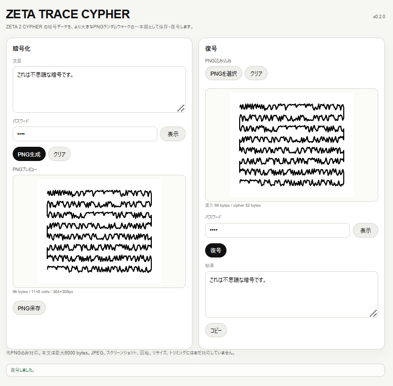

# ZETA TRACE CYPHER

**ZETA TRACE CYPHER** is a visual cipher experiment derived from **ZETA 2 CYPHER**.

It encrypts text first, then stores the encrypted data as a PNG random-walk trace.  
The visible line is not decoration.  
**The line itself is the encrypted data carrier.**

<p align="center">
  
</p>

## Concept

Ordinary encrypted data is often stored as text, symbols, or binary files.

ZETA TRACE CYPHER turns encrypted data into a visual trace.

A message is encrypted by the ZETA 2 CYPHER core, then transformed into a larger PNG random-walk drawing.  
The generated PNG can be loaded back into the app and decoded with the correct password.

In short:

```text
text
→ ZETA 2 encryption
→ random-walk PNG trace
→ PNG input
→ decryption
→ original text
```

The drawing is not an illustration of the ciphertext.  
It is the ciphertext.

## Features

- Text encryption
- Password-based decryption
- PNG random-walk output
- PNG input for decryption
- Larger visual carrier than the original text-based ZETA DATA format
- Up to 6000 bytes of input text
- Minimal, no-gimmick interface
- Works entirely in the browser
- No server-side storage

## How it works

ZETA TRACE CYPHER keeps the encryption core of ZETA 2 CYPHER and replaces the visible carrier.

Instead of outputting JSON text, it converts the encrypted byte data into a structured random-walk PNG.

The generated PNG can be read back by the same app, reconstructed into encrypted bytes, and then decrypted with the password.

The detailed visual carrier algorithm is intentionally unpublished.  
Security should not rely only on obscurity; the hidden visual grammar is treated as part of the artwork’s generative language.

## Current limitations

This version is an experimental visual carrier.

Supported:

- Original PNG files generated by this app
- PNG input without modification

Not supported yet:

- JPEG
- screenshots
- camera scanning
- rotation
- resizing
- trimming
- image compression
- damaged PNG recovery

If the PNG is edited, compressed, resized, or converted, it may no longer decode.

## Security note

ZETA TRACE CYPHER is an experimental personal cipher and visual data carrier.

The PNG trace may make the ciphertext visually obscure, but the strength of decryption still depends heavily on the password.  
Use a long, unique password.

This project has not been professionally audited.  
Do not use it as the sole protection for critical secrets.

## Version

```text
v0.2.0
```

## Project statement

> Text walks.  
> The walk becomes a line.  
> The line becomes the cipher.

## Author

MASATO NASU
